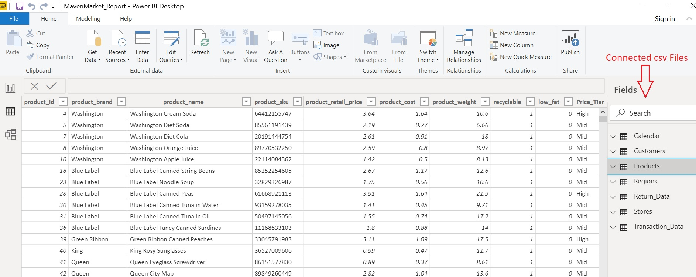
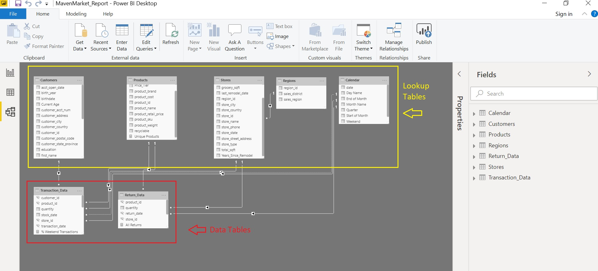

# Topline-Performance Analysis - Udemy Final Project: Maven Maket

In this project I will be working with 'Maven Market', a multi-national grocery chain with locations in Canada, Mexico and the United States.
Through an analysis of the Maven Market data set, the objective of this project is to calculate and visualize the top performance indicators for the client. Microsoft Power BI will be used through the entire business inteligence workflow.

# Some of the principal tasks in the project agenda:

1. Connecting and shaping the source data

2. Building a relational model

3. Adding calculated columns and measures

4. Designing an interactive report

# Visualizations and Analysis:

PART 1: Connecting & Shaping the Data

PART 2: Data Modeling: In the relationship view, arrange all the tables (Lookup, and Data Tables) by connecting them using valid primary/foreign keys

