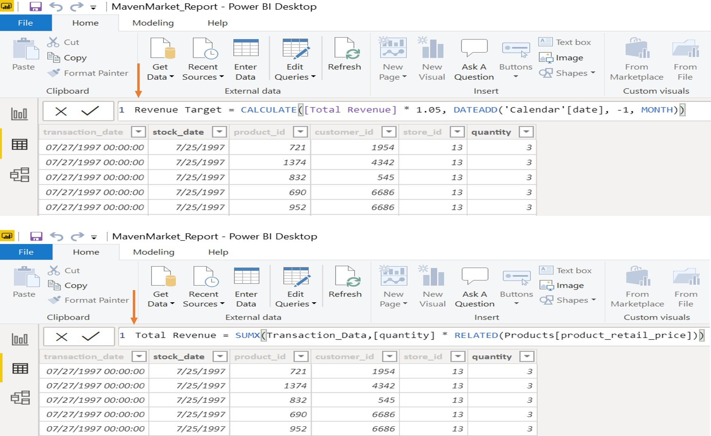

# Topline-Performance Analysis - Udemy Final Project: Maven Maket

In this project I will be working with 'Maven Market', a multi-national grocery chain with locations in Canada, Mexico and the United States.
Through an analysis of the Maven Market data set, the objective of this project is to calculate and visualize the top performance indicators for the client. Microsoft Power BI will be used through the entire business inteligence workflow.

# Some of the principal tasks in the project agenda:

1. Connecting and shaping the source data

2. Building a relational model

3. Adding calculated columns and measures

4. Designing an interactive report

# Visualizations and Analysis:

PART 1: Connecting & Shaping the Data

PART 2: Data Modeling: In the relationship view, arrange all the tables (Lookup, and Data Tables) by connecting them using valid primary/foreign keys

PART 3: Adding DAX Measures

Some of the principal Dax Measures below:

# PART 4: Building the final Report:

Dashboard Components:

1) Matrix visual to show Total Transactions, Total Profit, Profit Margin, and Return Rate by Product_Brand (on rows)

2) KPI Card to show Total Transactions, with Start of Month as the trend axis and Last Month Transactions as the target goal. Two additional KPI Cards for Total Profit (vs. Last month Profit) and one for Total Returns (vs. Last Month Returns)

3) Map visual to show Total Transactions by store city & Slicer for store country

4) Treemap visual to break down Total Transactions by store country

5) Column Chart to show Total Revenue by week, and format as you see fit

6) Gauge Chart to show Total Revenue against Revenue Target (as either "target value" or "maximum value")

